# Table of Contents

# Achievement 2

1. [Exercise 1](#exercise-1)
2. [Exercise 2](#exercise-2)
3. [Exercise 3](#exercise-3)
4. [Exercise 4](#exercise-4)

# Exercise 1

## Table of Contents

1. [Check Python Version](#check-python-version)
2. [Set Up a Virtual Environment](#set-up-a-virtual-environment)
3. [Install Django](#install-django)

## Check Python Version

Run command python3 -V to check for version 3.8.0

## Set Up a Virtual Environment

Create a new virtualenvironment called achievement2-practice. Confirm it's active in the terminal.

## Install Django

While in virtual environment achievement1-practice, pip install django and check version after install.

# Exercise 2

1. [Create A2_Recipe_App Folder](#create-a2_recipe_app-folder)
2. [Create a2-ve-recipeapp Virtual Environment](#Create-a2-ve-recipeapp-virtual-environment)
3. [Install Django in Virtual Environment](#install-django-in-virtual-environment)
4. [Create Django Project Named recipe_project](#create-django-project-named-recipe_project)
5. [Rename recipe_project Project Directory src](#rename-recipe_project-project-directory-src)
6. [Run Migrations and Run Rerver](#run-migrations-and-run-sever)
7. [Create SuperUser and Sign In](#create-superuser-and-sign-in)

# Create A2_Recipe_App Folder

# Create a2-ve-recipeapp Virtual Environment

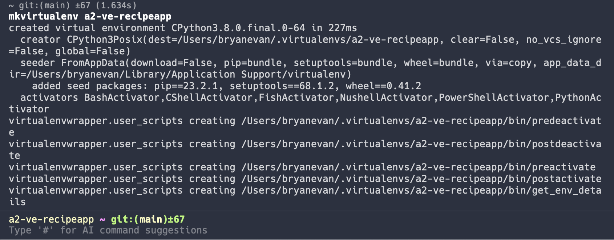

# Install Django in Virtual Environment

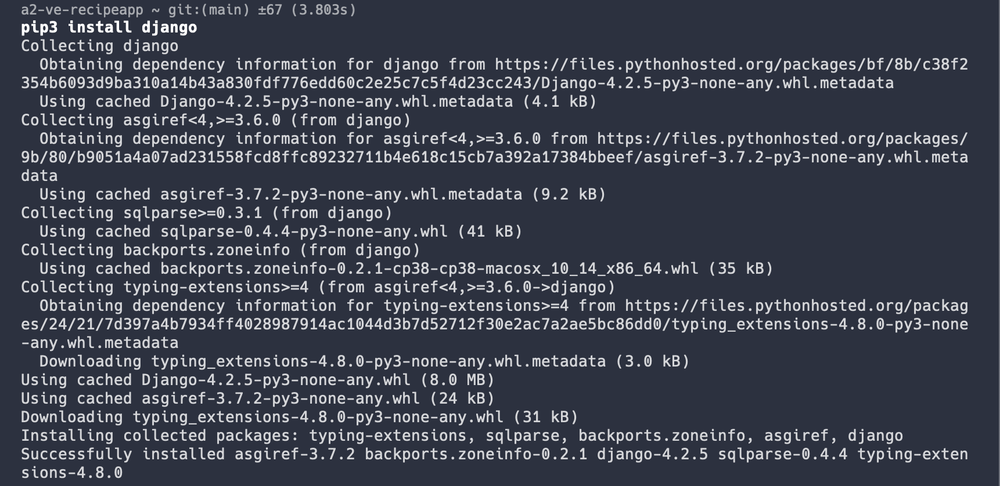

# Create Django Project Named recipe_project

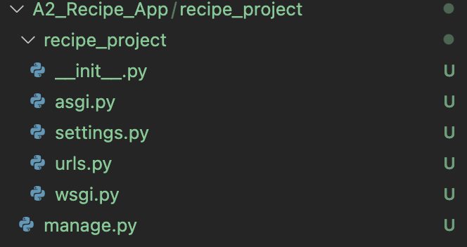

# Rename recipe_project Project Directory src

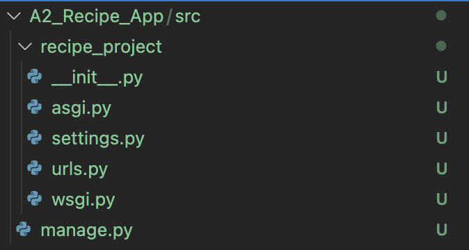

# Run Migrations and Run Rerver

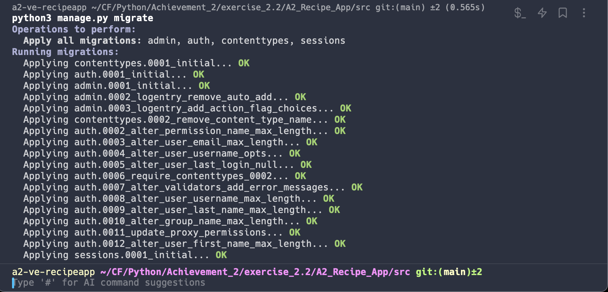
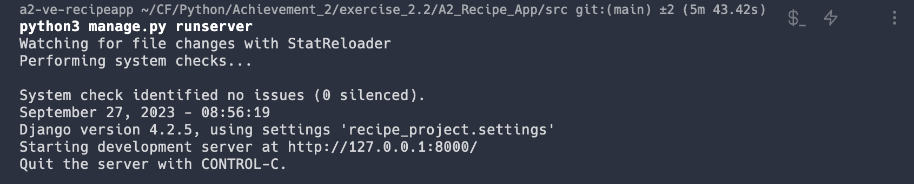

# Create SuperUser and Sign In

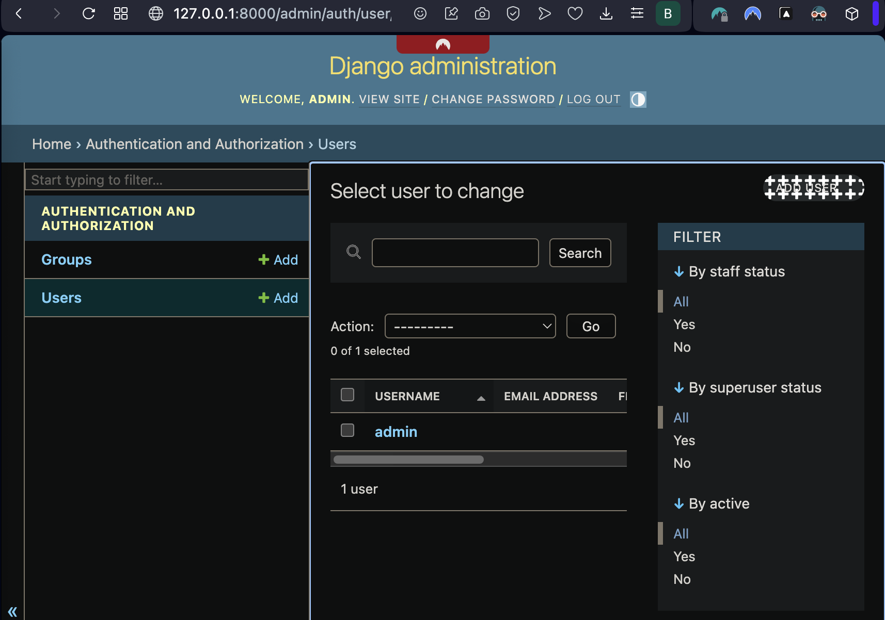

# Exercise 3

# Table of Contents

1. [Create App Schema](#create-app-schema)
2. [Establish Project Structure](#establish-project-structure)
3. [Migrate Models](#migrate-models)
4. [Test Models](#test-models)

# Create App Schema

Identify the desired attributes of each entity and their relation with other entities.

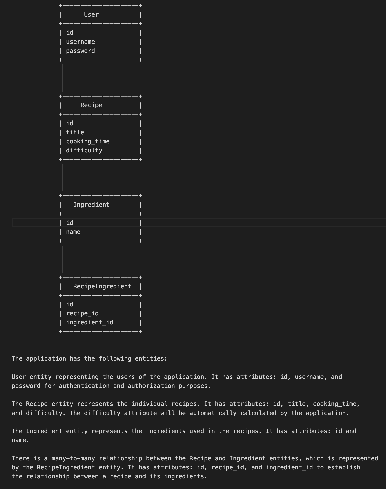

# Establish Project Structure

Create the apps drawn out in the schema and include links to projects in settings.py

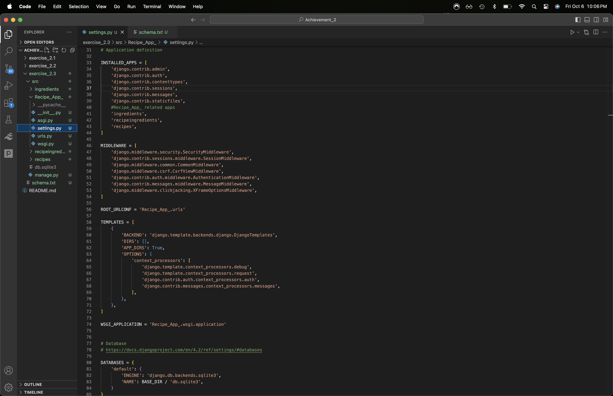

# Migrate Models

After building models within each app, register the models in their respective admin.py, then migrate.

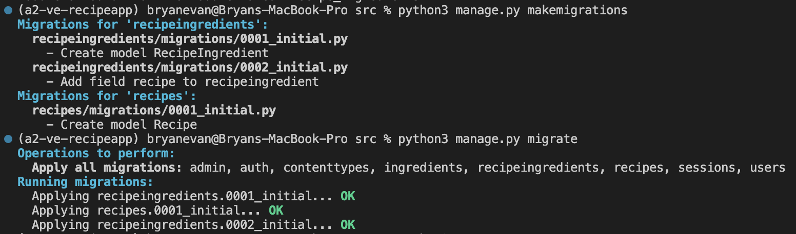

# Test Models

Build tests for all apps, respectively; run tests.

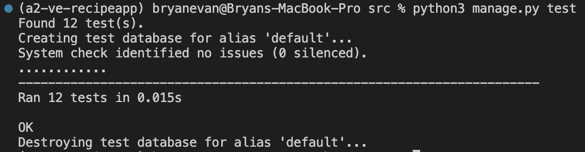

# Exercise 4

# Table of Contents

1. [Create Welcome Page](#creat-welcome-page)

# Create Welcome Page

Modify URLs to send user a welcome page with a basic outline.

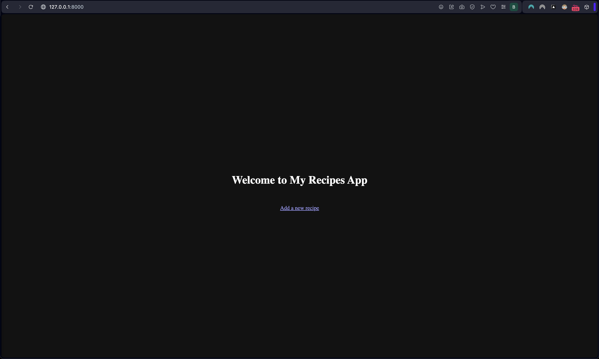
