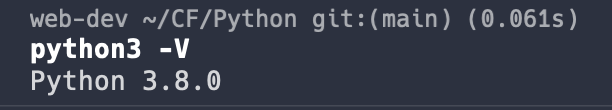
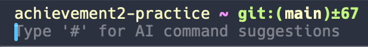
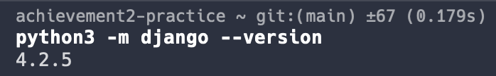

# Table of Contents
# Achievement 2

# Exercise 1

## Table of Contents

1. [Check Python Version](#check-python-version)
1. [Set Up a Virtual Environment](#set-up-a-virtual-environment)
2. [Install Django](#install-django)

## Check Python Version

Run command python3 -V to check for version 3.8.0

## Set Up a Virtual Environment

Create a new virtualenvironment called achievement2-practice. Confirm it's active in the terminal.

## Install Django

While in virtual environment achievement1-practice, pip install django and check version after install.

